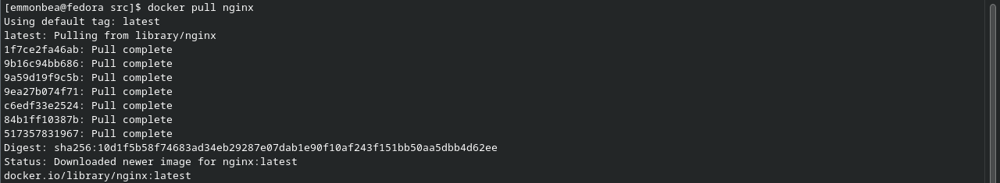
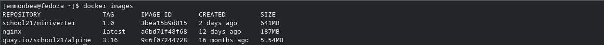

# Simple Docker

## Contents

1. [Part 1. Готовый докер](#part-1-готовый-докер)
2. [Part 2. Операции с контейнером](#part-2-операции-с-контейнером)
3. [Part 3. Мини веб-сервер](#part-3-мини-веб-сервер)
4. [Part 4. Свой докер](#part-4-свой-докер)
5. [Part 5. Dockle](#part-5-dockle)
6. [Part 6. Базовый Docker Compose](#part-6-базовый-docker-compose)

## Part 1. Готовый докер

1. Взять официальный докер образ с nginx и выкачать его при помощи `docker pull nginx` 
    

2. Проверить наличие докер образа через `docker images` 
    

3. Запустить докер образ через `docker run -d [image_id|repository]` 
    * 

[Contents](#Contents)

## Part 2. Операции с контейнером

[Contents](#Contents)

## Part 3. Мини веб-сервер

[Contents](#Contents)

## Part 4. Свой докер

[Contents](#Contents)

## Part 5. Dockle

[Contents](#Contents)

## Part 6. Базовый Docker Compose

[Contents](#Contents)