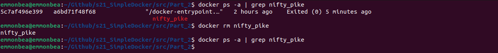

# Simple Docker

## Contents

1. [Part 1. Готовый докер](#part-1-готовый-докер)
2. [Part 2. Операции с контейнером](#part-2-операции-с-контейнером)
3. [Part 3. Мини веб-сервер](#part-3-мини-веб-сервер)
4. [Part 4. Свой докер](#part-4-свой-докер)
5. [Part 5. Dockle](#part-5-dockle)
6. [Part 6. Базовый Docker Compose](#part-6-базовый-docker-compose)

## Part 1. Готовый докер

1. Взять официальный докер образ с nginx и выкачать его при помощи `docker pull nginx` 
    

2. Проверить наличие докер образа через `docker images` 
    

3. Запустить докер образ через `docker run -d [image_id|repository]` 
    

4. Проверить, что образ запустился через `docker ps` 
    

5. Посмотреть информацию о контейнере через `docker inspect [container_id|container_name]` 

6. По выводу команды определить и поместить в отчёт размер контейнера, список замапленных портов и ip контейнера: 

    1. Размер контейнера: 
        

    2. Список замапленных портов: 
        

    3. ip контейнера: 
        

7. Остановить докер образ через `docker stop [container_id|container_name]` 

8. Проверить, что образ остановился через `docker ps` 
    

9. Запустить докер с портами 80 и 443 в контейнере, замапленными на такие же порты на локальной машине, через команду `run` 
    

10. Проверить, что в браузере по адресу **localhost:80** доступна стартовая страница nginx 
    

11. Перезапустить докер контейнер через `docker restart [container_id|container_name]` 

12. Проверить любым способом, что контейнер запустился 
    

[Contents](#contents)

## Part 2. Операции с контейнером

> P.S. Работа выполнялась в разное время, на разных контейрах, поэтому имена контейнеров и id отличаются от имени и id контейнера, созданного в Part 1.

1. Прочитать конфигурационный файл nginx.conf внутри докер контейнера через команду `exec` 
    * По умолчанию конфигурационный файл nginx.conf расположен в каталоге */usr/local/nginx/conf*, */etc/nginx* или */usr/local/etc/nginx*. На моей машине файл находится в каталоге /etc/nginx 
        

2. Создать на локальной машине файл nginx.conf 
    

3. Настроить в нем по пути /status отдачу страницы статуса сервера nginx 
    

4. Скопировать созданный файл nginx.conf внутрь докер образа через команду `docker cp` 
    

5. Перезапустить nginx внутри докер образа через команду `exec` 
    

6. Проверить, что по адресу localhost:80/status отдается страничка со статусом сервера nginx 
     
    

7. Экспортировать контейнер в файл container.tar через команду `export` 
    

8. Остановить контейнер 
    

9. Удалить образ через `docker rmi [image_id|repository]`, не удаляя перед этим контейнеры 
    

10. Удалить остановленный контейнер 
    

11. Импортировать контейнер обратно через команду `import` 
    * Инструкция CMD в Dockerfile определяет команду, которая будет выполнена по умолчанию при запуске контейнера. 
    

12. Запустить импортированный контейнер 
    

13. Проверить, что по адресу localhost:80/status отдается страничка со статусом сервера nginx 
     
    

[Contents](#contents)

## Part 3. Мини веб-сервер

1. Написать мини сервер на C и FastCgi, который будет возвращать простейшую страничку с надписью Hello World! 
    * Установить библиотеку libfcgi-dev, выполнив команду `sudo apt-get install libfcgi-dev`: 
         

    * Программа на C: 
         

    * Скомпилировать server.c, выполнив команду `gcc server.c -lfcgi -o server` 
         

2. Запустить написанный мини сервер через spawn-fcgi на порту 8080 
    * Установить библиотеку spawn-fcgi, выполнив команду `sudo apt-get install spawn-fcgi`: 
         

    * Запустить мини сервер через spawn-fcgi на порту 8080: 
         
    
> P.S. Дальше мне придется выполнять все то же самое, но внутри контейнера, потому что случится ошибка 502. В общем и целом запускать мини сервер следовало сразу внутри контейнера, но решил оставить эти манипуляции в отчете, т.к. убил много времени на это :(

3. Написать свой nginx.conf, который будет проксировать все запросы с 81 порта на 127.0.0.1:8080 
    1. Загрузить nginx, выполнив команду `docker pull nginx`: 
         
    
    2. Убедиться, что порт 81 не занят, выполнив команду `lsof -i :81`: 
         

    3. Запустить докер с портом 81 в контейнере, замапленным на такой же порт на локальной машине, через команду `docker run -d -p 81:81 nginx` 
         

    4. Создать на локальной машине файл nginx.conf 
         
    
    5. Настроить его на проксирование всех запросов с 81 порта на 127.0.0.1:8080 
         

    6. Скопировать созданный файл nginx.conf и server.c внутрь докер образа через команду `docker cp`: 
         

    7. Связать текущий терминал с терминалом контейнера objective_margulis командой `docker exec -it objective_margulis bash`: 
         
    
    8. Обновить пакеты командой `apt update`: 
         
    
    9. Установить gcc, spawn-fcgi, libfcgi-dev командой `apt install gcc spawn-fcgi libfcgi-dev`: 
         

    10. Скомпилировать и перезапустить: 
         

4. Проверить, что в браузере по localhost:81 отдается написанная вами страничка 
     

5. Положить файл nginx.conf по пути ./nginx/nginx.conf (это понадобится позже) 

[Contents](#contents)

## Part 4. Свой докер

1. Написать свой докер образ, который: 

    - собирает исходники мини сервера на FastCgi из [Части 3](#part-3-мини-веб-сервер)

    - запускает его на 8080 порту

    - копирует внутрь образа написанный ./nginx/nginx.conf

    - запускает nginx.

    >nginx можно установить внутрь докера самостоятельно, а можно воспользоваться готовым образом с nginx'ом, как базовым.

    Создавать докер образ я буду с помощью Dockerfile.
    
    1. Написать bash-скрипт run.sh, который компилирует файл server.c из прошлого задания (для удобства его копия лежит в Part_4) и запускает его на 8080 порту: 
         
    
    2. nginx.conf берется из [Части 3](#part-3-мини-веб-сервер) (для удобства его копия лежит в Part_4/nginx/)
         
    
    3. Создать Dockerfile, с настройками будущего образа (следует избегать множественных вызовов команд `RUN`): 
         

2. Собрать написанный докер образ через docker build при этом указав имя и тег 
     

3. Проверить через docker images, что все собралось корректно 
     

4. Запустить собранный докер образ с маппингом 81 порта на 80 на локальной машине и маппингом папки ./nginx внутрь контейнера по адресу, где лежат конфигурационные файлы nginx'а 
    * `docker run -it -p 80:81 -v /home/emmonbea/Github/s21_SimpleDocker/src/Part_4/nginx/nginx.conf:/etc/nginx/nginx.conf -d my_server:latest bash` 
         

5. Проверить, что по localhost:80 доступна страничка написанного мини сервера 
     

6. Дописать в ./nginx/nginx.conf проксирование странички /status, по которой надо отдавать статус сервера nginx 
     

7. Перезапустить докер образ 
     

8. Проверить, что теперь по localhost:80/status отдается страничка со статусом nginx 
     

[Contents](#contents)

## Part 5. Dockle

1. Просканировать образ из предыдущего задания через `dockle [image_id|repository]` 
    1. Установить dockle: 
         

    2. Просканировать образ, выполнив команду `dockle [image_id|repository]`: 
         

2. Исправить образ так, чтобы при проверке через dockle не было ошибок и предупреждений 
    >P.S. Способы решения ошибок: 
    **CIS-DI-0005** перед build'ом необходимо выполнить команду `export DOCKER_CONTENT_TRUST=1` и авторизоваться на DockerHub, но регистрироваться на DockerHub мне лень + у пира могут возникнуть проблемы. 
    **CIS-DI-0010** переключения версии nginx проблему не решает. Мне помогло изменение образа. Если использовать в качестве базового образа nginx, то dockle необходимо запускать с дополнительными флагами. Команда будет выглядеть следующим образом `dockle -i CIS-DI-0010 [image_name]:[image_tag]`. Происходит это из-за запросов nginx ключей NGINX_GPGKEY. 
    **UPD**: менять образ с nginx на ubuntu/nginx настоятельно не рекомендую. Проблемы возникнут при добавлении пользователя. 
    **CIS-DI-0001** с ней возникло больше всего проблем. Как писалось выше основные проблемы с переключением пользователя возникали при смене базового образа nginx на ubuntu/nginx. Никакие заглушки и костыли не помогли. Дело в том, что у пользователя, отличного от root не будет прав на запуск скрипта (даже если скрипт запускается не как исполняемый файл, а через bash). Даже после того, как я ему даю все необходимые права, сервер не запускается. Еще проблемы могут возникнуть в отсутствии файла nginx.pid. Без него у меня не запускается nginx. Странно, но у пользователя root отсутствие этого файла nginx не смущало. Скорее всего можно файл и не создавать, а просто дать права на запись. 
    **CIS-DI-0006** инструкция HEALTHCHECK используется для проверки состояния контейнера. В качестве аргументов передается `--interval=30s` - указывает интервал времени между проверками состояния контейнера;`--timeout=3s` - указывает максимальное время ожидания ответа от проверки состояния. Далее указывается команда, которая выполняется при каждой проверке состояния.

    * Обновленный dockerfile: 
         

    * Остальные файлы остались без изменений 

    * Для удобства проверки предусмотрен скрипт ./Part_5/help.sh. В нем же можете посмотреть список всех используемых команд. 

    * Результат сканирования образа с помощью dockle и вывод команды `curl localhost:80`
         

[Contents](#contents)

## Part 6. Базовый Docker Compose

1. Написать файл **docker-compose.yml**, с помощью которого:

    + Поднять докер контейнер из [5 части](#part-5-dockle). (он должен работать в локальной сети, т.е. не нужно использовать инструкцию `EXPOSE` и мапить порты на локальную машину) 

    + Поднять докер контейнер с nginx, который будет проксировать все запросы с 8080 порта на 81 порт первого контейнера 

    **Основные действия:**
    
    1. Для развертывания проекта, состоящего из нескольких докер образов для начала необходимо создать директорию приложения в следующем виде: 
         
        + Файл **docker-compose.yml** будет осдержать инструкции, необходимые для запуска и настройки сервисов.
        
        + Директория server будет содержать файлы, необходимые для поднятия контейнера из [5 части](#part-5-dockle).
            > Все таки пришлось изменить файл run.sh добавив строку `tail -f /dev/null`. Дело в то, что сразу после запуска проекта, сервер успешно завершал работу с кодом 0. Кмоанда выше как раз предотвращает завершение работы контейнера после выполнения всех команд.

        + Директория nginx будет содержать файлы, необходимые для поднятия контейнера на основе образа nginx.
    
    2. Файлы директории server остаются без изменений. Все настройки копируются из [5 части](#part-5-dockle).

    3. Настроить файл nginx.conf таким образом, чтобы контейнер проксировал все запросы с 8080 порта на 81 порт контейнера server: 
         

    4. Doker-compose.yml будет выглядеть следующим образом:
         

3. Замапить 8080 порт второго контейнера на 80 порт локальной машины 
     

4. Остановить все запущенные контейнеры 
     

5. Собрать и запустить проект с помощью команд `docker-compose build` и `docker-compose up`: 
     
     

6. Проверить, что в браузере по localhost:80 отдается написанная вами страничка, как и ранее 
     

[Contents](#contents)
